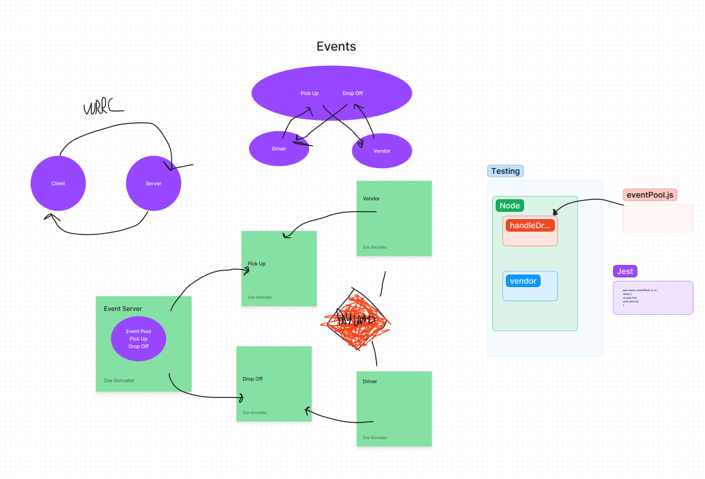

CAPS

Project: Event Emitters
Author: Zoe Gonzalez
Problem Domain:
This application is a culmination of all material learned throughout the last 2 weeks. It combines CRUD, routing, and authentication services. It also has compatibaility with SQL databases and moreso specifically postgres14, this project features authentication services and user role distributions. There is an embedded sample, and all of the text neccessary to run the program below.

GitHub Actions: https://github.com/ZuSolaris/Auth-Final/actions

Production Deployment: https://omg-shoes.onrender.com/

Setup
env requirements
see .env.sample

PORT: 3001

DATABASE_URL=postgres://localhost:5432/Auth-Final

How to initalize application
'npm start'

'nodemon'

node ./driver/driverHandler.js

node ./vendor/vendor.js

'node server.js'

How to use your library
-nodemon for starting

-npm test for testing

Features / Routes
/ : automatically redirects you to the page.

/shoes all shoes

/shoes:id individual shoe association

/signin: allows user to sign into existing account

/signup: allows user to create an account

/users: lists users

/* : If the page is not available then an error flag is thrown.

Workflow

